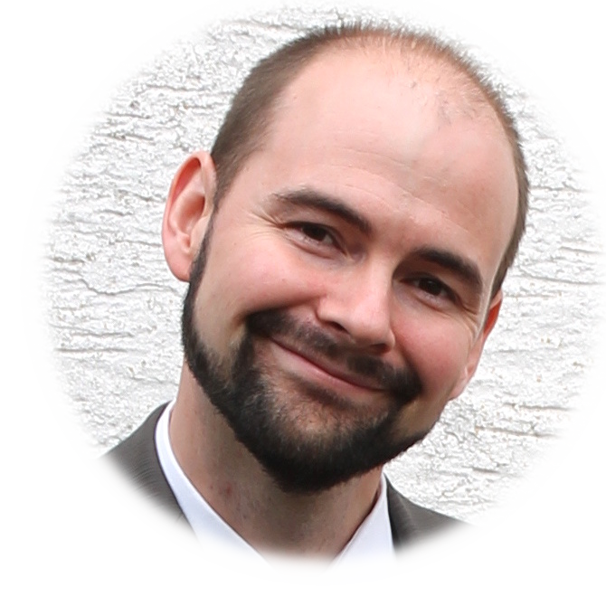

# Vorstellungsrunde

## geboren in Bonn
## wohnhaft in Bonn
### Hobbies: ich mag fast alles was Fell hat aber keine dicken Spinnen
### Hallo Welt!

# Thomas Happel Vorstellung
- Seit 2000 bei GS1 Germany
- verheiratet, 2 Kinder
- wohne in Köln
- gebohren in Köln, 09.10.1964
- FC Mitglied

# Anna

- geb. 87, Köln
- BWL
- Wein
  - *Chardonnay schadet nie*
- **Queen a.D.**
- GS1 seit 2019
  - vorher Videojet

# Mattias

- Geb. in Bergisch Gladbach 1981
- verheiratet, 3 Kinder
- Wohne in Ründeroth
- Ausgebildeter Fachinformatiker Systemintregration
- Videogames & alles was Strom hat!
- Seit 2019 bei GS1G
  - fTRACE Entwicklung

# Sebastian

- Geb. in Köln 1985
- verheiratet, 4 Kinder
- Lebe in Hürth
- Mathe und Physik studiert in Köln und UK
- Fraunhofer Softwareentwicklung
- Sei 2018 am EECC
  - Leite ich die "New Technologies"
  - Block Chain
  - ID Projekte, SSI
  - Forschungsprojekte, CIRC4Life
  - R-cycle

